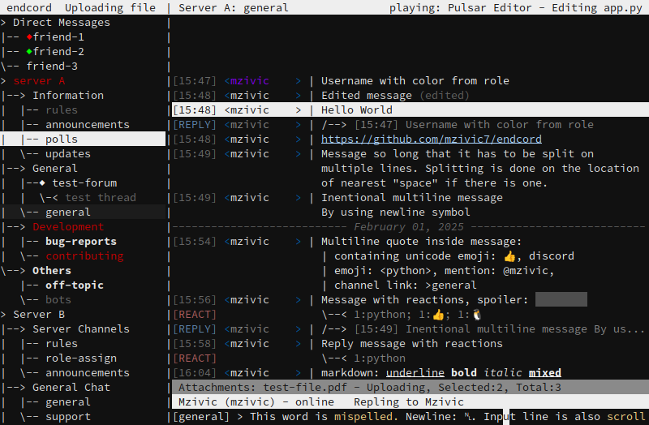

<h1>Endcord</h1>

endcord is a third-party feature rich Discord client, running entirely in terminal.  
It is built with python and ncurses library, to deliver lightweight yet feature rich experience.  
Discord token is required in order to run endcord! see [Token](##token).  
[Alternate theme](./.github/screenshots/02.png) with continuous lines.  

## Features
- Extremely low CPU and and RAM usage (~30MB)
- Live chat, send message
- Integrated RPC (only Rich Presence)
- Desktop notifications
- Download attachments (`Ctrl+W`)
- Select message and: reply (`Ctrl+R`), edit (`Ctrl+E`), delete (`Ctrl+D`), go to replied (`Ctrl+G`)
- When replying: toggle reply ping (`Ctrl+P`)
- Channel tree (Server/DM/Group)
    - Correct channel order
    - Hidden channels
    - Show muted chanels as gray
    - Show unread channels as bold
    - Show channels with mention as red
    - Navigate tree (`Ctrl+Up/Down`)
    - Expand categories and servers, enter channel (`Ctrl+Space`)
    - DMs in separate drop-down
- Show reactions, replied message, forwarded message
- Show embeds, attachment types and links
- Spellchecking
- Open link in browser (`Ctrl+O`)
- Infinite chat scrolling
- Keep deleted messages (OFF by default)
- Show who is typing
- Highlight messages with mentions
- Send 'typing' (ON by default)
- Insertable newline in input line (`Ctr+N`)
- Copy message text to clipboard (`Ctrl+H`)
- Hide or mask blocked/ignored users
- No ghost pings (hopefully)
- Role colors in chat
- Date separtors in chat
- Theming
- Customizable status, title and prompt lines
- Customizable chat lines (message, newline, reaction, reply)
- Customizable colors
- Automatic recovery on network failure
- Remember last open channel and tree state
- Resizable (unstable)
- Show discord emoji as `<emoji_name>`
- Show mentions as `@username`, `@role`, `@>channel_name`
- Quit on `Ctrl+C`

## Configuration
Settings and log file location:
- On linux: `~/.config/endcord/` or `$XDG_DATA_HOME/endcord/`  
- On windows: `%USERPROFILE%/AppData/Local/endcord/`  
- On mac: `~/Library/Application Support/endcord/`  
Run `endcord -h` or `endcord --help` to see possible command arguments.  
### Providing config
Custom config path can be provided with `-c [PATH_TO_CONFIG]` flag.
If config is not found at that path, default will be written.  
There can be missing entries in config, they will be filled with defaults.  
### Debug mode
Debug mode can be enabled with `-d` flag.  
It will cause extra messages to be written to log file.  
Endcord will periodically write to drive and log file will quickly grow in size.  
Log is overwritten on each run.  
### Token
Token is used to access Discord through your account without logging-in.  
It is required to to use endcord.  
After obtaining token, you can either:  
- Pass token to endcord as command argument: `endcord -t [YOUR_TOKEN]`  
- Save token in config - recommended  
See [FAQ](#FAQ) for more info on obtaining your Discord token.  
## Config options
Go to [configuration](configuration.md).

## Usage
### Keybindings
Navigating messages - `Arrow-Up/Down`  
Navigating channel tree - `Ctrl+Up/Down`  
Insert newline - `Ctrl+N`  
Scroll back to bottom - `Ctrl+H`  
Expand selected categories and servers - `Ctrl+Space`  
Enter selected channel - `Ctrl+Space`  
Reply to selected message - `Ctrl+R`  
Edit selected message - `Ctrl+E`  
Delete selected message - `Ctrl+D`  
Toggle reply ping when replying - `Ctrl+P`  
Go to replied message - `Ctrl+G`  
Copy message to clipboard - `Ctrl+B`  
Open link in browser - `Ctrl+O`  
Download attachment - `Ctrl+W`  
Upload attachments - `Ctrl+U`  
Cancel all downloads/uploads - `Ctrl+X`  
Cancel selected attachment - `Ctrl+K`  
Paste text - terminal paste, usually `Ctrl+Shift+V`  
If UI ever gets messed up, redraw it - `Ctrl+L`  
Quit - `Ctrl+C`  
### Newline
Newline can be added to input line by pressing `Ctrl+N`.  
To keep text in one line it is represented as `␤` only in input line.  
When message is sent, it will be split in newlines properly.  
### Chat scrolling
When last message in chat buffer is selected, buffer will be extended with older messages.  
If number of messages in buffer exceeds `limit_chat_buffer` value in config, chat will be trimmed on the opposite side.  
If latest message is missing, then buffer can be extended with newer messages by selecting first message in buffer.  
### Downloading / Open in browser
Downloading and opening links have similar mechanism:  
If there is one item, download will start immediately / open in browser.  
If there are multiple items, it will prompt for a single number indicating what item.  
Items can be:  
- Links and attachments for 'open in browser'  
- Only attachments for 'download'.  
Links are counted first. Items are counted from start to end of the message, in order.  
Downloads are parallel. `Ctrl+X` will cancel ALL downloads and attachments, with a confirmation prompt.  
### Uploading
Uploading is initiated by pressing `Ctrl+U`. Previously typed content will be cached.  
Type path to file that should be uploaded and press enter. Cached content will be restored.  
Wait until file is uploaded and then send the message. Mutliple files can be added this way.  
Path can be absolute or relative, and has autocomplete on `tab` key.  
If file size exceeds discord's limit it will not be added to the sent message.  
Attachments can be navigated with `Ctrl+Left/Right` in extra line (above status line).  
`Ctrl+X` will cancel ALL downloads and attachments, with a confirmation prompt.  
`Ctrl+K` will cancel selected attachment (and stop upload) and remove it from attachments list.
### RPC
For now RPC is only implemented for Linux, it is automatically disabled on other platforms.  
And only supports Rich Presence over IPC, which means no process detection, subscriptions, join requests, lobby, etc.  
Because of this, some apps may not connect, misbehave or even error. If that happen, disable RPC in config.  
Usually RPC app must be started after RPC server (endcord).  
More info about whats going on can be found in log, when endcord is in debug mode.  
### Theming
Custom theme path can be provided with `-c [PATH_TO_THEME]` flag or in `config.ini`.
`[theme]` section in `config.ini` is default theme. If custom theme is provided eiter with argument or in `[main]` section, those values wil be used.  
Same format and entries as in `config.ini` are used in custom themes (as separate file). If any value is missing, it will be loaded from `config.ini`, and if its missing there too, default value will be used.  
If only file name is provided, without `.ini` extension, theme will be searched in `Themes` directory, in the same location where config is.

## Installing
### Linux
- From AUR: `yay -S endcord`  
- Build, then copy built executable to system:  
    `sudo cp dist/endcord /usr/local/sbin/`
Optional dependencies:  
- `xcopy` - Clipboard support on X11  
- `wl-clipboard` - Clipboard support on Wayland  
- `aspell` - Spellchecking

> [!WARNING]
> Using third-party client is against Discord's Terms of Service and may cause your account to be banned!  
> **Use endcord at your own risk!**

## Building
### Linux
1. Clone this repository: `git clone https://github.com/mzivic7/endcord.git`
2. Install [pipenv](https://docs.pipenv.org/install/)
3. `cd endcord`
4. Install requirements: `pipenv install --dev`
5. run build script: `pipenv run python build.py`

### Windows
1. Install [Python](https://www.python.org/) 3.12 or later
2. Install [pipenv](https://docs.pipenv.org/install/) (optional)
3. Clone this repository, unzip it
4. Open terminal, cd to unzipped folder
5. Install requirements: `pipenv install --dev`  
    - Additional requirements: `pipenv install win10toast win11toast windows-curses`
6. Run build script: `pipenv run python build.py`
#### Without pipenv:  
5. Open `Pipfile` with text editor and install all packages and dev-packages with pip.
6. Then run build script: `python build.py`
> [!NOTE]
> For now, Windows is only partially supported because how cmd works.
> Emojis are missing, Ctrl+Arrows is not working.
> Might not work after building.

### Mac OS
Never tested. Feedback is welcome.

## FAQ
### Obtaining your Discord token
1. Open Discord in browser.
2. Open developer tools (`F12` or `Ctrl+Shift+I` on Chrome and Firefox).
3. Go to the `Network` tab then refresh the page.
4. In the 'Filter URLs' text box, search `discord.com/api`.
5. Click on any filtered entry. On the right side, switch to `Header` tab search for the `authorization`.
6. Copy value of `Authorization: ...` found under `Request Headers` (right click -> Copy Value)
7. This is your discord token. Do not share it!
### To further decrease probability of getting banned
- MOST IMPORTANT: Do not use endcord to perform any out-of-ordinary actions (ie. self-bots). Discord has spam heuristic algorithm for catching self-bots, third party clients can sometimes trip it.
- Discord REST API is called each time client is started, when channel is changed and message is seen and sent. It would be best to not abuse these actions in order to reduce REST API calls.
- Do not leave endcord on busy channels running in background
- Sending ack (when channel is marked as seen) is throttled by endcord to 5s (configurable).
- Typing status and Rich Presence are using WebSocket so disabling will will make no difference.
### What if you get banned?
You can write to Discord TNS team: https://dis.gd/request.  
If you did something particular with endcord that caused the ban, open an issue describing what that is. Maybe that can be prevented or other users can be warned.  
### Debug files
Anonymized data that might help in debugging is saved in `Debug` directory, at the same place where log file is.  
All channel and server names, topics, descriptions are replaced. All channel and server IDs are added to random number and hashed, so they are irreversible changed, and will be different on each run.

## Planned features
Go to [TODO](todo.txt).
