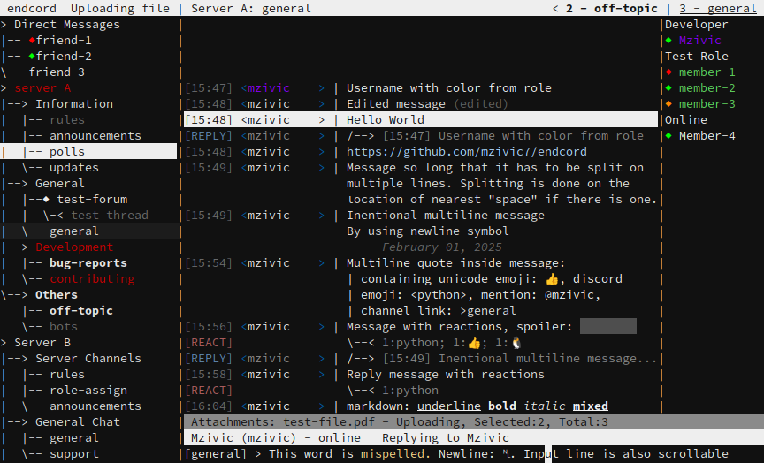

<h1>Endcord</h1>
<a href="https://github.com/mzivic7/endcord?tab=readme-ov-file#features">Features</a> |
<a href="https://github.com/mzivic7/endcord/blob/main/screenshots.md">Screenshots</a> |
<a href="https://github.com/mzivic7/endcord?tab=readme-ov-file#configuration">Config</a> |
<a href="https://github.com/mzivic7/endcord?tab=readme-ov-file#usage">Usage</a> |
<a href="https://github.com/mzivic7/endcord?tab=readme-ov-file#installing">Installing</a> |
<a href="https://github.com/mzivic7/endcord?tab=readme-ov-file#building">Building</a> |
<a href="https://github.com/mzivic7/endcord?tab=readme-ov-file#faq">FAQ</a>

Endcord is a third-party feature rich Discord client, running entirely in terminal.  
It is built with python and ncurses library, to deliver lightweight yet feature rich experience.  
Discord token is required in order to run endcord! see [Token](#token).  
[More screenshots](https://github.com/mzivic7/endcord/blob/main/screenshots.md).  

## Features
- Extremely low CPU and and RAM usage (values greatly depend on number of servers and channels)
- View images, gifs, videos, audio and stickers in terminal with ASCII art or external app (`Ctrl+V`)
- Integrated RPC (only Rich Presence)
- Desktop notifications
- Download/upload attachments (`Ctrl+W/U`)
- Select message and: reply (`Ctrl+R`), edit (`Ctrl+E`), delete (`Ctrl+D`), go to replied (`Ctrl+G`)
- Member list (`Alt+M`)
- Toggle reply ping (`Ctrl+P`)
- Search messages (`Ctrl+F`)
- View user prfile (`Alt+P`)
- Channel tree (Server/DM/Group)
    - Correct channel order
    - Dont show hidden channels
    - Show muted chanels as gray
    - Show unread channels as bold
    - Show channels with mention as red
    - Navigate tree (`Ctrl+Up/Down`)
    - Expand categories and servers, enter channel (`Ctrl+Space`)
    - DMs in separate drop-down, show DM status
    - Forums, channel threads
    - View channel or server info (`Alt+I`)
- Show reactions, replied message, forwarded message
- Show embeds, attachment types and links, code blocks
- Spellchecking
- Assist when typing channel/username/role/emoji/sticker
- Record and send voice messages (`Alt+R`)
- Undo/Redo in input line (`Alt+Z`, `Alt+Shift+Z`)
- Open link in browser (`Ctrl+O`)
- Unlimited chat scrolling
- Keep deleted messages (OFF by default)
- Highlight messages with mentions
- Show who is typing
- Send 'typing' (ON by default)
- Insertable newline in input line (`Ctr+N`)
- Copy message text to clipboard (`Ctrl+H`)
- Hide or mask blocked/ignored users
- No ghost pings (when client is running)
- Role colors in chat
- Date separtors in chat
- Partial markdown support (underline, bold, italic, spoiler, quote)
- Sending emoji support with `:emoji:` (only default)
- Theming
- Customizable status, title and prompt lines
- Customizable chat lines (message, newline, reaction, reply)
- Customizable colors and ASCII art
- Automatic recovery on network failure
- Remember last open channel and tree state
- Resizable
- Show discord emoji as `:emoji_name:`
- Show mentions as `@username`, `@role`, `@>channel_name`
- Quit on `Ctrl+C`

## Configuration
Settings, log, state and themes location:
- On linux: `~/.config/endcord/` or `$XDG_DATA_HOME/endcord/`  
- On windows: `%USERPROFILE%/AppData/Local/endcord/`  
- On mac: `~/Library/Application Support/endcord/`  

Run `endcord -h` or `endcord --help` to see possible command arguments.  

### Providing config
Custom config path can be provided with `-c [PATH_TO_CONFIG]` flag.  
If config is not found at that path, default will be written.  
There can be missing entries in config, they will be filled with defaults.  

### Debug mode
Debug mode can be enabled with `-d` flag.  
It will cause extra messages to be written to log file.  
Endcord will periodically write to drive and log file will quickly grow in size.  
Log is overwritten on each run.

### Token
Token is used to access Discord through your account without logging-in.  
It is required to to use endcord.  
After obtaining token, you can either:  
- Pass token to endcord as command argument: `endcord -t [YOUR_TOKEN]`  
- Save token in config - recommended  

### Keybinding
Keybindings are configured in separate section in `config.ini`.  
Key combinations are saved as integer codes, that can be generated by running `endcord --keybinding`.  
`Alt+Key` codes are saved as string with format: `"ALT+[KEY]"`, where `[KEY]` is integer.  
Note that some codes can be different across systems.  
`Ctrl+Shift+Key` combinations are not supported by most terminal emulators, but `Alt+Shift+Key` are.  
Default "expand categories and servers" is rebound to `Ctrl+A` on windows.  
Kaybindings can also be chained like this (maximum 2 bindings in chain, separated with `-`):  
`"25-97"` - for `Ctrl+X-A` which means: press `Ctrl+X` then `A`,  
`"ALT+120-ALT+100"` - for `Alt+X-Alt+D` and so on.  

See [FAQ](#FAQ) for more info on obtaining your Discord token.  

### Config options
Go to [configuration](configuration.md).

## Usage
### Keybindings
Navigating messages - `Arrow-Up/Down`  
Navigating channel tree - `Ctrl+Up/Down`  
Insert newline - `Ctrl+N`  
Scroll back to bottom - `Ctrl+H`  
Expand selected categories and servers - `Ctrl+Space`  
Enter selected channel - `Ctrl+Space`  
Reply to selected message - `Ctrl+R`  
Edit selected message - `Ctrl+E`  
Delete selected message - `Ctrl+D`  
Toggle reply ping when replying - `Ctrl+P`  
Go to replied message - `Ctrl+G`  
View user profile (selected message) - `Alt+P`  
View channel info (selected in tree) - `Alt+I`  
Copy message to clipboard - `Ctrl+B`  
Open link in browser - `Ctrl+O`  
Download attachment - `Ctrl+W`  
View attached media (image, gif, video, audio) - `Ctrl+V`  
Upload attachments - `Ctrl+U`  
Cancel all downloads/uploads - `Ctrl+X`  
Cancel selected attachment - `Ctrl+K`  
Reveal one spoiler in selected messages - `Ctrl+T`  
Paste text - terminal paste, usually `Ctrl+Shift+V`  
Undo input line - `Alt+Z`  
Redo input line - `Alt+Shift+Z`  
Un/collapse channel with threads in tree - `Alt+T`  
Join/leave selected thread in tree - `Alt+J`  
Open selected post in forum - `Enter`  
Open and join selected post in forum - `Alt+K`  
Copy selected message url to clipboard - `Alt+U`  
Copy selected channel ( in tree) url to clipboard - `Alt+Shift+U`  
Go to #channel/message mentioned in selected message - `Alt+G`  
Locally hide channel - `Alt+H`  
If UI ever gets messed up, redraw it - `Ctrl+L`  
Media player: quit - `escape`, pause - `Space`, seek - `Left/Right`, replay - `Z`  
Cancel action, leave media viewer - `Escape`  
Quit - `Ctrl+C`  

### Channel Tree
If tree object has `>` befor the object name, it means it has sub-objects (its drop-down).  
Objects are un/collapsed with `Ctrl+Space`. Channels with threads are un/collapsed on `Alt+T`.  
Channel with threads are collapsed by default.  
Thread can be joined or left (toggle) on `Alt+J`.  

### Newline
Newline can be added to input line by pressing `Ctrl+N`.  
To keep text in one line it is represented as `␤` only in input line.  
When message is sent, it will be split in newlines properly.

### Chat scrolling
When last message in chat buffer is selected, buffer will be extended with older messages.  
If number of messages in buffer exceeds `limit_chat_buffer` value in config, chat will be trimmed on the opposite side.  
If latest message is missing, then buffer can be extended with newer messages by selecting first message in buffer.  

### Downloading / Open in browser
Downloading and opening links have similar mechanism:  
If there is one item, download will start immediately / open in browser.  
If there are multiple items, it will prompt for a single number indicating what item.  
Items can be:  
- Links and attachments for 'open in browser'  
- Only attachments for 'download'.  
Links are counted first. Items are counted from start to end of the message, in order.  
Downloads are parallel. `Ctrl+X` will cancel ALL downloads and attachments, with a confirmation prompt.  

### Uploading
Uploading is initiated by pressing `Ctrl+U`. Previously typed content will be cached.  
Type path to file that should be uploaded and press enter. Cached content will be restored.  
Wait until file is uploaded and then send the message. Mutliple files can be added this way.  
Path can be absolute or relative, and has autocomplete on `tab` key.  
If file size exceeds discord's limit it will not be added to the sent message.  
Attachments can be navigated with `Ctrl+Left/Right` in extra line (above status line).  
`Ctrl+X` will cancel ALL downloads and attachments, with a confirmation prompt.  
`Ctrl+K` will cancel selected attachment (and stop upload) and remove it from attachments list.

### Extra window and member list navigation
Same controls for navigating in extra window and member list:
`Alt+Up/Down` - Go up/down  
`Alt+Enter` - perform action on selected line (depends on context)  
Extra window navigation is prioritized over member list.  
Extra window is drawn for viewing:
- User profile info - from selected message (`Alt+P`)
- Channel/server info - from selected tree channel (`Alt+I`)
- Summaries for currently open channel (`Alt+S`), `Alt+Enter` will jump to first message in chat on that sumamry topic.
- Search and search results (`Ctrl+F`), `Alt+Enter` will jump to selected message.  

`Alt+Enter` in member list will whow user profile of the selected member.  

### Assist with mention, role, channel, emoji, sticker
When typing eg. username prepended with `@` assist will open as extra window with search results for typed text after `@` (search is case-insensitive).  
Assist triggers are (the first character): `@username`, `@role`, `#channel`, `:emoji:`, `;sticker;`.  
Press `Esc` to stop assist. Re-type trigger to start it again.  
Navigation: `Alt+Up/Down` - Go up/down, `Alt+Enter` or `Enter` - insert selected item.  
When inserted in input line, item will usually be shown as `<some_numbers>` - that is intended - do not alter it.  
To search multiple words use `_`, space will end assist.  
Stickers and emojis are sorted into packs, and will be shown as `pack name - emoji/sticker name`, and search is performed on that string.  
Sticker will also be added to message text and removed when sending.  

### Escape key priority order:
Stop recording, close extra window, stop replying, everything else.

### Emoji
To add default emoji in message just type its name or alias, like this: `:thumbs_up:`  
For now, there is no emoji assist, but it is planned.  
Emoji names can be found [here](https://unicode.org/emoji/charts/full-emoji-list.html) and aliases [here](https://www.webfx.com/tools/emoji-cheat-sheet/).  

### RPC
For now RPC is only implemented for Linux, it is automatically disabled on other platforms.  
And only supports Rich Presence over IPC, which means no process detection, subscriptions, join requests, lobby, etc.  
Because of this, some apps may not connect, misbehave or even error. If that happen, disable RPC in config.  
Usually RPC app must be started after RPC server (endcord).  
More info about whats going on can be found in log, when endcord is in debug mode.  

### Forums
Forums in tree can be opened just like a channel (`Ctrl+Space`). It will load only the most recent posts (unarchived) and show them in chat buffer.  
Select post and `Enter` to open it, or `Alt+K` to open and join.  
Posts are treated same as threads in channel tree, but only participated posts will be shown.  
If there are no posts in the forum (this will happen when switching to forum in never opened server), switch to some channel in the same server, (client must subscribe to some channel so discord can send thread list sync).

### Hiding channels
Some channels are not hidden in endcord, even tho they are in official client. more info on why in [FAQ](#FAQ).  
Also some servers my not provide an ability to hide channels.  
Thats why in endcord channels can be locally hidden, by selecting channel in channel tree and pressing `Alt+H`.  
Locally hidden channels can be restored by removing them in `hidden_channels.json`, see [Configuration](#configuration) for path.  

### Terminal size
Recommended terminal size for proper viewing is minimum 118 columns and 32 rows, for default theme.

### Theming
Custom theme path can be provided with `-c [PATH_TO_THEME]` flag or in `config.ini`.
Theme can also be changed in `config.ini` under section `[theme]`.  
Loading order: argument theme -> `config.ini` theme -> builtin default theme. There can be missing settings.  
If theme is not found at provided path, default theme will be written to it.  
If only file name is provided, without `.ini` extension, theme will be searched in `Themes` directory, see [Configuration](#configuration) for path.  
There are 2 default themes: `default` and `better_lines`, they are assumed to be drawn on dark background (preferably black).  

### Media support
Very large number of image and video formats are supported thanks to pillow and PyAV.  
All the visual media is converted to ASCII art that can be additionally configured in [theme](configuration.md).  
Optionally in config can be set to open media in external app (cross-system, will use default system app for that file format).  
Audio is also played along with the video.  
"endcord-lite", without ASCII media support, can be built by not specifying `--lite` flag to build script. Lite version is significantly smaller in size, but still can open media in external app.  

## Installing
### Linux
- From AUR:
    - `yay -S endcord` - full version with media support, larger executable
    - `yay -S endcord-lite` - lite version without media support
- Build, then copy built executable to system:  
    `sudo cp dist/endcord /usr/local/bin/`

Optional dependencies:
- `xclip` - Clipboard support on X11  
- `wl-clipboard` - Clipboard support on Wayland  
- `aspell` - Spellchecking

### Windows
Install [windows terminal](https://github.com/microsoft/terminal) or [cmder](https://github.com/cmderdev/cmder), or any other modern terminal.  
Build, standalone executable can be found in `./dist/endcord.exe`.  
Run exe from wt or cmder.  
Optional dependency, for spellchecking: [aspell](https://github.com/adamyg/aspell-win32). It is expected to be installed in `C:\Program Files (x86)\`. If it is not, please open an issue and provide the actual install path. Alongside with base aspell, dictionary must be installed, even en_US.  
Emoji and Ctrl+key support depends on terminal.  

### macOS
Build, standalone executable can be found in `./dist/`.  
Optional dependency, for spellchecking: [aspell](https://github.com/adamyg/aspell-win32). Can be installed with: `brew aspell`.  
Never tested on macOS. Feedback is welcome.

> [!WARNING]
> Using third-party client is against Discord's Terms of Service and may cause your account to be banned!  
> **Use endcord at your own risk!**

## Building
### Linux
1. Clone this repository: `git clone https://github.com/mzivic7/endcord.git`
2. Install [pipenv](https://docs.pipenv.org/install/)
3. `cd endcord`
4. Setup virtual environment: `pipenv install`
5. run build script
    - to build endcord: `pipenv run python build.py --build`
    - to build endcord-lite: `pipenv run python build.py --build --lite`

### Windows
1. Install [Python](https://www.python.org/) 3.13 or later
2. Install [pipenv](https://docs.pipenv.org/install/)
    - `pip install pipenv`
3. Clone this repository, unzip it
4. Open terminal, cd to unzipped folder
4. Setup virtual environment: `pipenv install`
5. run build script
    - to build endcord: `pipenv run python build.py --prepare --build`
    - to build endcord-lite: `pipenv run python build.py --prepare --build --lite`

### macOS
1. Install [Python](https://www.python.org/) 3.13 or later
2. Install [pipenv](https://docs.pipenv.org/install/)
    - `pip install pipenv`
3. Clone this repository, unzip it
4. Open terminal, cd to unzipped folder
4. Setup virtual environment: `pipenv install`
5. run build script
    - to build endcord: `pipenv run python build.py --build`
    - to build endcord-lite: `pipenv run python build.py --build --lite`

## FAQ
### Obtaining your Discord token
1. Open Discord in browser.
2. Open developer tools (`F12` or `Ctrl+Shift+I` on Chrome and Firefox).
3. Go to the `Network` tab then refresh the page.
4. In the 'Filter URLs' text box, search `discord.com/api`.
5. Click on any filtered entry. On the right side, switch to `Header` tab search for the `authorization`.
6. Copy value of `Authorization: ...` found under `Request Headers` (right click -> Copy Value)
7. This is your discord token. Do not share it!

### To further decrease probability of getting banned
- MOST IMPORTANT: Do not use endcord to perform any out-of-ordinary actions (ie. self-bots). Discord has spam heuristic algorithm for catching self-bots, third party clients can sometimes trip it.
- Discord REST API is called each time client is started, when channel is changed and message is seen and sent. It would be best to not abuse these actions in order to reduce REST API calls.
- Do not leave endcord on busy channels running in background.
- Do not repeatedly view user profiles.
- Sending ack (when channel is marked as seen) is throttled by endcord to 5s (configurable).
- Disable `rpc_external` in config - it calls REST API for fetching external resources for Rich Presence.
- Typing status and Rich Presence are using WebSocket so disabling it will make no difference.

### What if you get banned?
You can write to Discord TNS team: https://dis.gd/request.  
If you did something particular with endcord that caused the ban, open an issue describing what that is. Maybe that can be prevented or other users can be warned.  

### Debug files
Anonymized data that might help in debugging is saved in `Debug` directory, see [Configuration](#configuration) for path.  
All channel and server names, topics, descriptions are replaced. All channel and server IDs are added to random number and hashed, so they are irreversible changed, and will be different on each run.

### Some role colors are wrong
This is an [issue](https://github.com/python/cpython/issues/119138) with cpython ncurses API. It is ignoring color pairs with ID larger than 255. This means only 255 color pairs can actually be used. Only role colors can reach this limit, because they are initialized last.
This will be updated in endcord when cpython issue is resolved.

### Status sign in tree has no color when selected or active
Same reason as above, colors will be added when curses bug is fixed.  

### No emoji
If emoji are drawn as empty box or simmilar, it means emoji are not supported by this terminal. In that case, enable `emoji_as_text` in `config.ini`.

### Sticker cannot be opened
If the message says it "cannot be opened", then this is lottie sticker. These stickers have special vector way of drawing animations and will not be supported.

### Must send at least N messages in official client
The client will refuse to send message in newly-created DM channels. This measure is to prevent triggering discords spam filter.

### No notification sound
Custom notification sound can be set in config: `custom_notification_sound = /path/to/file.mp3`.

### Search by user/channel not working
Currently search will only work if user/channel ID is provided instead name. Search will be upgraded with name assist in the future.

### Running in headless Linux tty
Linux tty by default supports only 16 colors. Endcord will fail to initialize colors and not start.  
However endcord can be run inside fbterm [fbterm](https://salsa.debian.org/debian/fbterm), adding support for 256 colors.  
Follow [fbterm setup instructions](https://wiki.archlinux.org/title/Fbterm#Installation), then set environment variable: `export TERM=fbterm` and run endcord.  
Note: `Ctrl+Up/Down/Left/Right` have different key codes in tty.

### Spacebar and other custom hosts
Connecting to [Spacebar](https://github.com/spacebarchat) or any other discord-like instance can be configured in `config.ini`. Set `custom_host = ` to prefered host domain, like `spacebar.chat`. Set to `None` to use default host (`discord.com`).  
Then endcord will connect only to that domain instead discord.  Token is diffeerent on different hosts!  
Note that using custom host is completely untested, and support depends on how differnet the api is to original discord api, and may crash at any time. Further, each host may have different spam filters, so **use at your own risk** still applies.

## Planned features
Go to [TODO](todo.txt).

### Features that will not be added
Following features have significant risk of triggering discords spam filter, and may cause account to be limited or even banned.  
Therefore they will NOT be implemented in endcord.  
Features: sending friend request, opening new DM.
