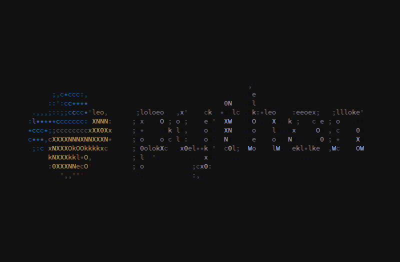

<h1>Endcord</h1>  Features</a> |
<a href="https://github.com/mzivic7/endcord/blob/main/screenshots.md">Screenshots</a> |
<a href="https://github.com/mzivic7/endcord?tab=readme-ov-file#configuration">Config</a> |
<a href="https://github.com/mzivic7/endcord?tab=readme-ov-file#usage">Usage</a> |
<a href="https://github.com/mzivic7/endcord?tab=readme-ov-file#installing">Installing</a> |
<a href="https://github.com/mzivic7/endcord?tab=readme-ov-file#building">Building</a> |
<a href="https://github.com/mzivic7/endcord?tab=readme-ov-file#faq">FAQ</a>
  
<b>Standard theme:<b> 

  
<b>Alternate theme with better lines:<b> 

  
<b>Media with ASCII art:<b> 

